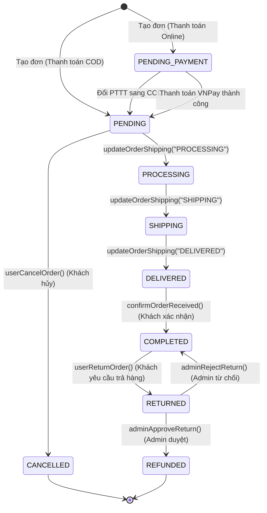

# CHAPTER 4: KIỂM THỬ CHUYỂN TRẠNG THÁI (STATE TRANSITION TESTING)
## VÒNG ĐỜI ĐƠN HÀNG & VẬN CHUYỂN (ORDER & SHIPPING LIFECYCLE)

**Issue Key / Scrum Task**: YIYI-48 (Thay thế YIYI-48 hiển thị card riêng trên Scrum Board)  
**Tác giả**: Sinh viên thực hiện kiểm thử  
**Đối tượng kiểm thử**: `OrderService`, `OrderController`, `Order` Entity, `ShippingStatus` Enum  

---

## 1. TỔNG QUAN & MỤC TIÊU

Trong hệ thống E-commerce Bookstore, đơn hàng trải qua nhiều giai đoạn xử lý từ lúc khách hàng đặt hàng, người bán chuẩn bị, giao hàng cho tới khi hoàn tất hoặc hủy/trả hàng. Việc áp dụng kỹ thuật **State Transition Testing (Kiểm thử chuyển trạng thái)** nhằm đảm bảo:
1. Mọi chuyển trạng thái **hợp lệ (Valid Transitions)** tuân thủ đúng luồng nghiệp vụ API.
2. Mọi chuyển trạng thái **không hợp lệ (Invalid Transitions)** bị hệ thống từ chối và phản hồi lỗi chính xác.
3. Không sử dụng các trạng thái tự bịa; toàn bộ dựa trên source code thực tế (`com.bookstore.entity.ShippingStatus` và `com.bookstore.entity.Order`).

---

## 2. KHÁO SÁT CÁC TRẠNG THÁI TRONG SOURCE CODE

### 2.1. Enum `ShippingStatus` (`com.bookstore.entity.ShippingStatus`)
Hệ thống định nghĩa 6 trạng thái giao hàng chính thức:
- `PENDING`: Đơn hàng vừa tạo, chờ người bán xác nhận/xử lý.
- `PROCESSING`: Người bán đang đóng gói và chuẩn bị hàng.
- `SHIPPING`: Đã giao cho đơn vị vận chuyển, đang trên đường giao.
- `DELIVERED`: Đơn vị vận chuyển đã giao thành công tới người mua.
- `CANCELLED`: Đơn hàng đã bị hủy.
- `RETURNED`: Đơn hàng đã hoàn trả.

### 2.2. Trạng thái Đơn hàng `Order.status` (String)
Hệ thống sử dụng các giá trị chuỗi sau để quản lý trạng thái chung:
- `PENDING`: Đơn hàng COD mới tạo.
- `PENDING_PAYMENT`: Đơn hàng thanh toán online (VNPay) chờ thanh toán.
- `PROCESSING`: Đóng gói/chuẩn bị.
- `SHIPPED`: Đã/Đang vận chuyển (`SHIPPING` hoặc `DELIVERED`).
- `COMPLETED`: Khách hàng đã bấm xác nhận đã nhận được hàng.
- `CANCELLED`: Đơn hàng bị hủy.
- `RETURNED`: Khách hàng gửi yêu cầu trả hàng.
- `REFUNDED`: Đã hoàn tiền (khi Admin duyệt trả hàng hoặc hủy đơn online).

---

## 3. SƠ ĐỒ CHUYỂN TRẠNG THÁI (STATE TRANSITION DIAGRAM)



---

## 4. BẢNG MÔ HÌNH CHUYỂN TRẠNG THÁI (STATE TRANSITION TABLE)

| Initial State (`ShippingStatus` / `Order.status`) | Event (Sự kiện / API Call) | Next State (`ShippingStatus` / `Order.status`) | Action / Response |
| :--- | :--- | :--- | :--- |
| **N/A** | `POST /api/orders` (COD) | `PENDING` / `PENDING` | Trừ tồn kho, lưu đơn hàng |
| **N/A** | `POST /api/orders` (VNPay) | `PENDING` / `PENDING_PAYMENT` | Trừ tồn kho, chờ VNPay callback |
| **PENDING_PAYMENT** | `PUT /api/orders/{id}/payment-method` (COD) | `PENDING` / `PENDING` | Chuyển PTTT sang COD, xóa giỏ hàng |
| **PENDING** | `PUT /api/orders/{id}/shipping?status=PROCESSING` | `PROCESSING` / `PROCESSING` | Cập nhật thông tin giao hàng |
| **PROCESSING** | `PUT /api/orders/{id}/shipping?status=SHIPPING` | `SHIPPING` / `SHIPPED` | Gán mã vận đơn, đối tác vận chuyển |
| **SHIPPING** | `PUT /api/orders/{id}/shipping?status=DELIVERED` | `DELIVERED` / `SHIPPED` | Đánh dấu đã giao hàng |
| **DELIVERED** | `PUT /api/orders/{id}/confirm-received` | `DELIVERED` / `COMPLETED` | Tích điểm thưởng VIP/Y-Points |
| **PENDING** | `PUT /api/orders/{id}/cancel` | `CANCELLED` / `CANCELLED` | Hoàn tồn kho, hoàn Y-Points |
| **COMPLETED** | `PUT /api/orders/{id}/return` | `DELIVERED` / `RETURNED` | Ghi nhận lý do & thông tin ngân hàng |
| **RETURNED** | `PUT /api/orders/{id}/return/approve` | `DELIVERED` / `REFUNDED` | Admin duyệt trả hàng, hoàn tiền |
| **RETURNED** | `PUT /api/orders/{id}/return/reject` | `DELIVERED` / `COMPLETED` | Admin từ chối, khôi phục COMPLETED |
| **SHIPPING** | `PUT /api/orders/{id}/cancel` | **Refused (SHIPPING)** | Throw Exception: "Chỉ có thể huỷ đơn khi chưa xác nhận giao" |
| **DELIVERED** | `PUT /api/orders/{id}/cancel` | **Refused (DELIVERED)** | Throw Exception: "Chỉ có thể huỷ đơn khi chưa xác nhận giao" |
| **PROCESSING** | `PUT /api/orders/{id}/return` | **Refused (PROCESSING)** | Throw Exception: "Chỉ có thể yêu cầu trả hàng khi đã hoàn thành" |
| **COMPLETED** | `PUT /api/orders/{id}/return/approve` | **Refused (COMPLETED)** | Throw Exception: "Chỉ có thể duyệt đơn đang yêu cầu trả hàng" |

---

## 5. DANH SÁCH TEST CASE & KẾT QUẢ KIỂM THỬ (TEST RESULTS)

Bộ kiểm thử tự động được triển khai tại file [`OrderStateTransitionTest.java`](file:///g:/KI%20HE%20NAM%203/TestingProject/backend/src/test/java/com/bookstore/service/OrderStateTransitionTest.java).

### 5.1. Nhóm Chuyển trạng thái Hợp lệ (Valid State Transitions)

| Test Case ID | Initial State | Event / Phương thức gọi | Next State | Expected Result | Actual Result | Status |
| :--- | :--- | :--- | :--- | :--- | :--- | :---: |
| **ST-01** | `PENDING` | `updateOrderShipping("PROCESSING")` | `PROCESSING` | `shippingStatus=PROCESSING`, `status=PROCESSING` | Khớp | **PASS** |
| **ST-02** | `PROCESSING` | `updateOrderShipping("SHIPPING")` | `SHIPPING` | `shippingStatus=SHIPPING`, `status=SHIPPED` | Khớp | **PASS** |
| **ST-03** | `SHIPPING` | `updateOrderShipping("DELIVERED")` | `DELIVERED` | `shippingStatus=DELIVERED`, `status=SHIPPED` | Khớp | **PASS** |
| **ST-04** | `DELIVERED` | `confirmOrderReceived()` | `COMPLETED` | `status=COMPLETED`, cộng điểm Y-Points | Khớp | **PASS** |
| **ST-05** | `PENDING` | `userCancelOrder()` | `CANCELLED` | `shippingStatus=CANCELLED`, `status=CANCELLED` | Khớp | **PASS** |
| **ST-06** | `COMPLETED` | `userReturnOrder()` | `RETURNED` | `status=RETURNED`, lưu thông tin trả hàng | Khớp | **PASS** |
| **ST-07** | `RETURNED` | `adminApproveReturn()` | `REFUNDED` | `status=REFUNDED` | Khớp | **PASS** |
| **ST-08** | `RETURNED` | `adminRejectReturn()` | `COMPLETED` | `status=COMPLETED`, xóa thông tin trả hàng | Khớp | **PASS** |
| **ST-09** | `PENDING_PAYMENT` | `updatePaymentMethod("COD")` | `PENDING` | `status=PENDING`, `paymentMethod=COD` | Khớp | **PASS** |

### 5.2. Nhóm Chuyển trạng thái Không hợp lệ (Invalid State Transitions)

| Test Case ID | Initial State | Event / Phương thức gọi | Targeted Next State | Expected Result | Actual Result | Status |
| :--- | :--- | :--- | :--- | :--- | :--- | :---: |
| **IT-01** | `SHIPPING` | `userCancelOrder()` | `CANCELLED` | Bị từ chối (RuntimeException: Chỉ hủy khi PENDING) | Ném ngoại lệ như kỳ vọng | **PASS** |
| **IT-02** | `DELIVERED` | `userCancelOrder()` | `CANCELLED` | Bị từ chối (RuntimeException: Chỉ hủy khi PENDING) | Ném ngoại lệ như kỳ vọng | **PASS** |
| **IT-03** | `PROCESSING` | `userReturnOrder()` | `RETURNED` | Bị từ chối (RuntimeException: Chỉ trả hàng khi COMPLETED) | Ném ngoại lệ như kỳ vọng | **PASS** |
| **IT-04** | `COMPLETED` | `adminApproveReturn()` | `REFUNDED` | Bị từ chối (RuntimeException: Chỉ duyệt khi RETURNED) | Ném ngoại lệ me như kỳ vọng | **PASS** |
| **IT-05** | `CANCELLED` | `adminRejectReturn()` | `COMPLETED` | Bị từ chối (RuntimeException: Chỉ từ chối khi RETURNED) | Ném ngoại lệ như kỳ vọng | **PASS** |
| **IT-06** | `COMPLETED` | `confirmOrderReceived()` | `COMPLETED` | Bị từ chối (RuntimeException: Đã hoàn thành trước đó) | Ném ngoại lệ như kỳ vọng | **PASS** |
| **IT-07** | `COMPLETED` | `updatePaymentMethod("VNPAY")` | `PENDING_PAYMENT` | Bị từ chối (RuntimeException: Không cho đổi PTTT) | Ném ngoại lệ như kỳ vọng | **PASS** |
| **IT-08** | `PENDING` | `updateOrderShipping("INVALID")` | Enum bất hợp lệ | Bị từ chối (IllegalArgumentException) | Ném ngoại lệ như kỳ vọng | **PASS** |

---

## 6. BẰNG CHỨNG CHẠY TEST (EXECUTION EVIDENCE)

Kết quả thực thi Maven Surefire JUnit 5 cho bộ kiểm thử [`OrderStateTransitionTest.java`](file:///g:/KI%20HE%20NAM%203/TestingProject/backend/src/test/java/com/bookstore/service/OrderStateTransitionTest.java):

```text
[INFO] -------------------------------------------------------
[INFO]  T E S T S
[INFO] -------------------------------------------------------
[INFO] Running com.bookstore.service.OrderStateTransitionTest
[INFO] Running com.bookstore.service.OrderStateTransitionTest$ValidTransitionsTest
[INFO] Tests run: 9, Failures: 0, Errors: 0, Skipped: 0, Time elapsed: 3.518 s -- in com.bookstore.service.OrderStateTransitionTest$ValidTransitionsTest
[INFO] Running com.bookstore.service.OrderStateTransitionTest$InvalidTransitionsTest
[INFO] Tests run: 8, Failures: 0, Errors: 0, Skipped: 0, Time elapsed: 0.165 s -- in com.bookstore.service.OrderStateTransitionTest$InvalidTransitionsTest
[INFO] Tests run: 0, Failures: 0, Errors: 0, Skipped: 0, Time elapsed: 3.738 s -- in com.bookstore.service.OrderStateTransitionTest
[INFO] 
[INFO] Results:
[INFO] 
[INFO] Tests run: 17, Failures: 0, Errors: 0, Skipped: 0
[INFO] -------------------------------------------------------
[INFO] BUILD SUCCESS
[INFO] -------------------------------------------------------
```

---

## 7. BÁO CÁO BUG (JIRA BUG REPORT)

Trong quá trình đối chiếu source code tại `OrderService.java` (hàm `updateOrderShipping`), đội kiểm thử phát hiện một lỗi logic cho phép chuyển trạng thái bất hợp lệ qua API của người bán:

### **Jira Bug: [BUG-ORDER-01] Thiếu kiểm tra ma trận chuyển trạng thái hợp lệ trong API `updateOrderShipping`**

- **Project**: TestingProject (Scrum Board)
- **Issue Type**: Bug
- **Summary**: API `PUT /api/orders/{id}/shipping` cho phép ép trạng thái giao hàng từ `CANCELLED` sang `DELIVERED` mà không có validation logic.
- **Severity**: Medium / Major
- **Mô tả chi tiết**:
  - Tại `OrderService.java` dòng 310-326, hàm `updateOrderShipping` nhận tham số `status` dạng String và thiết lập trực tiếp `order.setShippingStatus(ShippingStatus.valueOf(status))`.
  - Hệ thống không kiểm tra trạng thái hiện tại của đơn hàng. Nếu đơn hàng đã bị người mua HỦY (`CANCELLED`), người bán vẫn có thể gọi API `updateOrderShipping(id, "DELIVERED")` để đổi trạng thái đơn thành `DELIVERED` và `SHIPPED`.
- **Các bước tái hiện (Steps to Reproduce)**:
  1. Người mua đặt đơn và hủy đơn thành công -> Đơn hàng có `shippingStatus = CANCELLED`.
  2. Người bán gọi API `PUT /api/orders/{id}/shipping?status=DELIVERED`.
  3. Đơn hàng chuyển sang `DELIVERED` bất chấp việc đã bị hủy trước đó.
- **Kết quả kỳ vọng (Expected Result)**: Hệ thống cần kiểm tra nếu đơn hàng ở trạng thái `CANCELLED` hoặc `COMPLETED`, API phải từ chối và ném `RuntimeException("Không thể thay đổi trạng thái giao hàng cho đơn hàng đã hủy/hoàn thành!")`.
- **Kết quả thực tế (Actual Result)**: Hệ thống chấp nhận và lưu trạng thái mới `DELIVERED` vào cơ sở dữ liệu.
